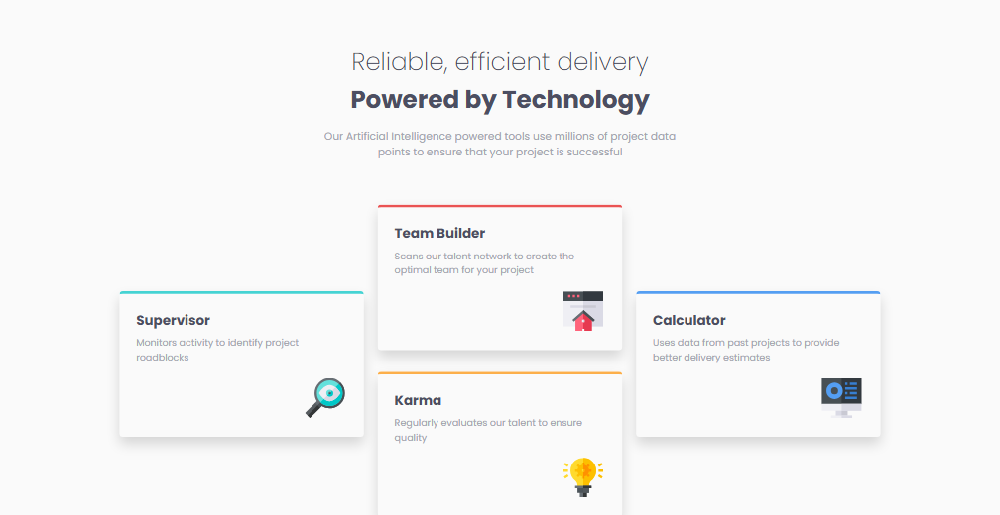

# Frontend Mentor - Four card feature section solution

This is a solution to the [Four card feature section challenge on Frontend Mentor](https://www.frontendmentor.io/challenges/four-card-feature-section-weK1eFYK). Frontend Mentor challenges help you improve your coding skills by building realistic projects.

## Table of contents

- [Overview](#overview)
  - [The challenge](#the-challenge)
  - [Screenshot](#screenshot)
  - [Links](#links)
- [My process](#my-process)
  - [Built with](#built-with)
  - [What I learned](#what-i-learned)
  - [Continued development](#continued-development)
  - [Useful resources](#useful-resources)
- [Author](#author)

## Overview

### The challenge

Users should be able to:

- View the optimal layout for the site depending on their device's screen size

### Screenshot



### Links

- Solution URL: [Solution](https://artemkotko14.github.io/four_card_feature_section/)

## My process

### Built with

- Semantic HTML5 markup
- BEM
- Flexbox
- CSS Grid
- Mobile-first workflow
- SASS

### What I learned

In this section I've learned how can I use CSS Grid for making a responsive design.

```css
.cards {
  display: grid;
  grid-template-columns: repeat(3, 1fr);
  grid-template-rows: repeat(4, 1fr);
  justify-content: center;
  align-items: center;
  gap: 20px;
}
.card--team-builder {
  grid-column: 2;
  grid-row: 1/3;
}

.card--supervisor {
  grid-column: 1;
  grid-row: 2/4;
}

.card--calculator {
  grid-column: 3;
  grid-row: 2/4;
}

.card--karma {
  grid-column: 2;
  grid-row: 3/5;
  margin-top: -20px;
}
```

I also practised using Sass extension and use of BEM methodology.

### Continued development

In my future projects I want to focus on making responsive designs with CSS Grid and using Sass extension.

### Useful resources

- [Grid Garden](https://cssgridgarden.com/) - This great game helped me understand CSS Grid.

## Author

- Github - [Artem Kotko](https://github.com/artemkotko14)
- Frontend Mentor - [@artemkotko14](https://www.frontendmentor.io/profile/artemkotko14)
